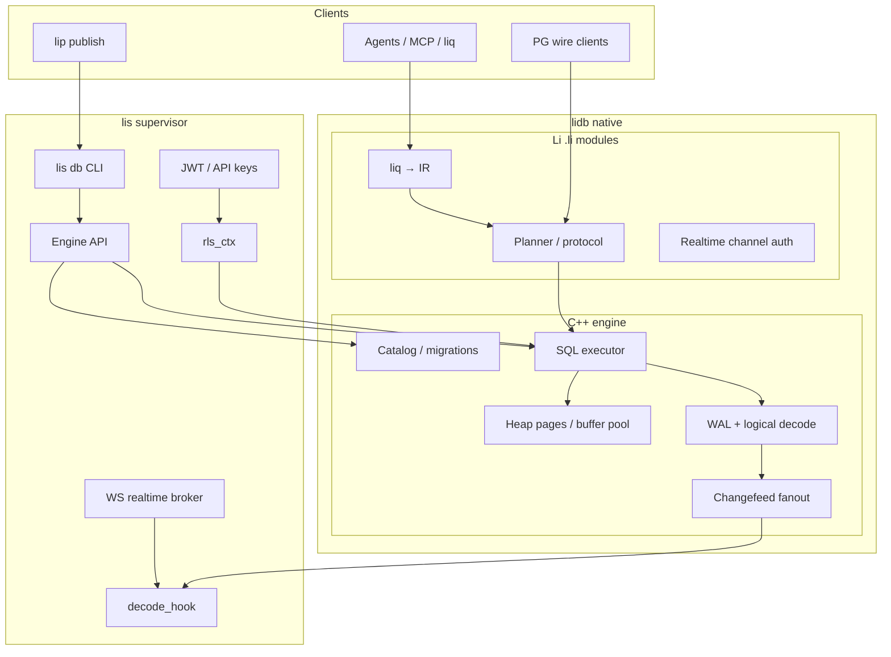
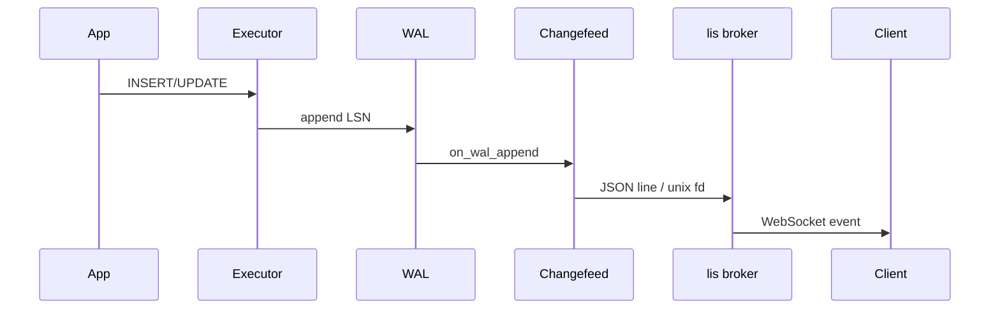

# Architecture ADR: native Li implementation (`lidb` + `lis`)

**Status:** Draft  
**Date:** 2026-05-25  
**PH / REQ:** PH-DB-1, **PH-DB-3.1** (sqlite smoke removal), PH-DB-7 (realtime)  
**Roadmap:** [`lidb-native-li-matrices.md`](https://github.com/li-langverse/roadmap/blob/main/proposals/lidb-native-li-matrices.md), [`lidb-li-data-platform.md`](https://github.com/li-langverse/roadmap/blob/main/proposals/lidb-li-data-platform.md)

## Summary

**lidb** ships a **C++17 storage engine** (heap pages + WAL) with **Li** (`.li`) modules for SQL planner, protocol surfaces, realtime auth, and agent-facing query compilation. **lis** supervises the bundle (CLI, profiles, WS broker). **SQLite3 is not a long-term dependency** — PH-DB-1 smoke is retired at **PH-DB-3.1**.

---

## Why remove sqlite3 smoke (PH-DB-3.1)

| Problem | Impact | PH-DB-3.1 action |
|---------|--------|------------------|
| **Dialect drift** | `001_registry_embedded.sql` ≠ `001_registry.sql` | Single native catalog DDL |
| **False CI signal** | Green smoke does not exercise WAL/heap | `scripts/smoke.sh` → `lidb_embed` only |
| **Security surface** | Python `sqlite3` + shell `sqlite3` bypass parameterized C++ path | Delete `embed_engine.py` sqlite path |
| **Agent confusion** | Docs implied Postgres engine while CI used sqlite | `pg-subset-v1.md` status table = honest |
| **Realtime blockers** | sqlite triggers ≠ WAL logical decoding | `Changefeed::on_wal_append` native only |

**Exit criteria (PH-DB-3.1):** CI does not install `sqlite3`; `liorm.execute()` never opens `sqlite3.Connection`; `embedded.cpp` does not shell out; migration applies `001_registry.sql` via `Catalog::apply_migration`.

---

## Layered architecture

| Layer | Language | Responsibility |
|-------|----------|----------------|
| **Storage** | C++ | 8 KiB pages, pin/unpin, WAL records (`LIDW`), checkpoint stub |
| **Executor** | C++ (+ Li hooks) | Parameterized DML/DDL for `pg-subset-v1` |
| **Catalog** | C++ | Migrations, minimal `pg_catalog` shape |
| **Planner / protocol** | Li | Parse subset, plan cache, PG wire subset (WP-N6) |
| **liq / liorm** | Python + Li IR | Agent-safe plans; `execute(plan_id, params)` |
| **Realtime** | Li + C++ hook | WAL events → JSON → `lis` Unix socket / WS |
| **Auth / RLS** | Li + `lis` | JWT claims → session GUCs → policy eval (WP-N7) |

**Rule:** Hot paths that need memory safety and CVE class coverage stay in **audited C++**; policy and protocol logic in **Li** with `lic` interop where the master plan allows.

---

## Learned from (per competitor)

Engineering-standards style: survey → extract → adapt → document.

| System | Keep | Reject |
|--------|------|--------|
| **PostgreSQL** | WAL + heap mental model; registry DDL; `tier_db_registry` oracle | Full extensions, `PL/pgSQL`, replication v1 |
| **SQLite** | — | File format, `sqlite3` CLI, embedded smoke catalog |
| **Supabase** | Vertical checklist; RLS-first; Realtime topic ergonomics | 10+ container default compose |
| **Supabase Realtime** | Logical replication → channel fanout | Separate Elixir service in **registry-min** |
| **Neon** | WAL as source of truth for branching (future) | Cloud-only split for MVP |
| **DuckDB** | Columnar ideas for analytics export (PH-DB-G0) | Primary store for registry OLTP |
| **pgvector** | HNSW/IVFFlat patterns, distance ops | Postgres extension install path |
| **Neo4j / Kùzu** | Cypher ergonomics for WP-N9 spike | Mandatory graph store in v1 |
| **Prisma / Drizzle** | Migrations discipline, prepared statements | ORM string SQL from agents |
| **Electric SQL** | Sync intent for offline agents | Client sqlite as server backend |
| **GoTrue** | JWT claims layout for RLS | Separate auth microservice in min profile |
| **MinIO / S3** | Attestation object layout | Mandatory for registry-min |

Full competitor tables: [roadmap `lidb-native-li-matrices.md`](https://github.com/li-langverse/roadmap/blob/main/proposals/lidb-native-li-matrices.md).

---

## Realtime: WAL logical decoding → `lis` WS broker

### Requirements (normative for WP-N3)

| ID | Requirement |
|----|-------------|
| **RT-1** | Every committed heap `INSERT`/`UPDATE` on subscribed tables produces a WAL record with monotonic **LSN**. |
| **RT-2** | `lidb::Changefeed::on_wal_append` emits `{ lsn, table, op, payload }` — **no sqlite triggers**. |
| **RT-3** | Decode hook exposes **poll** (`poll_json_line`) and **push** (Unix socket fanout) for `lis` embedding. |
| **RT-4** | `lis` broker maps `(schema, table, filter)` → WS topic; protocol v1 documented in `docs/realtime-v1.md` (stub until WP-N3 lands). |
| **RT-5** | Subscribe requires valid JWT; **WP-N7** adds RLS-filtered events (drop rows failing policy). |
| **RT-6** | **registry-min** profile: `modules.realtime = false` — zero broker threads. |

### Data flow

Implementation anchors: `engine/include/lidb/changefeed.hpp`, `engine/changefeed.cpp`.

---

## Work packages (this repo)

See roadmap matrices for full scheduling. Mapping:

| WP | lidb paths | lis paths |
|----|------------|-----------|
| **WP-N1** | `engine/*wal*`, `engine/*buffer*`, `src/storage_smoke.cpp` → native | — |
| **WP-N2** | `engine/native_exec.*`, `migrations/001_registry.sql` | — |
| **WP-N3** | `changefeed.*` | broker stub in `lis` (sibling repo) |
| **WP-N4** | `scripts/smoke.sh` timing hooks | — |
| **WP-N5** | `tests/security/` | — |
| **WP-N6** | Li protocol module | wire listener optional profile |
| **WP-N7** | `docs/auth-rls.md` enforcement | JWT middleware |
| **WP-N8** | `engine/vector/` (TBD) | — |
| **WP-N9** | `lidb-graph` package stub | — |

---

## Agent continuation

1. **Read:** `docs/pg-subset-v1.md`, `engine/include/lidb/changefeed.hpp`, `../roadmap/proposals/lidb-native-li-matrices.md`
2. **Run:** `bash scripts/smoke.sh` && `bash scripts/run_tests.sh` (cmake + native tests)
3. **Then:** implement WP-N1+N2 until PH-DB-3.1 cutover PR removes sqlite
4. **Blocked on:** PH-DB-3.1 merge requires N1+N2 exit gates (no sqlite in CI)

## Not changed (this ADR)

- Full Postgres replication / HA
- `lidb-graph` / GPU multi-model (PH-DB-G0 research only)
- lip registry v2 HTTP (PH-DB-4, **lic** / **lip** repos)

## Links

- Competitor matrices: [roadmap/proposals/lidb-native-li-matrices.md](https://github.com/li-langverse/roadmap/blob/main/proposals/lidb-native-li-matrices.md)
- Native engine scheduling: [roadmap/proposals/lidb-native-engine.md](https://github.com/li-langverse/roadmap/blob/main/proposals/lidb-native-engine.md)
- Benchmark tier: [tier-db-registry-benchmark.md](https://github.com/li-langverse/benchmarks/blob/main/docs/ecosystem/tier-db-registry-benchmark.md)
