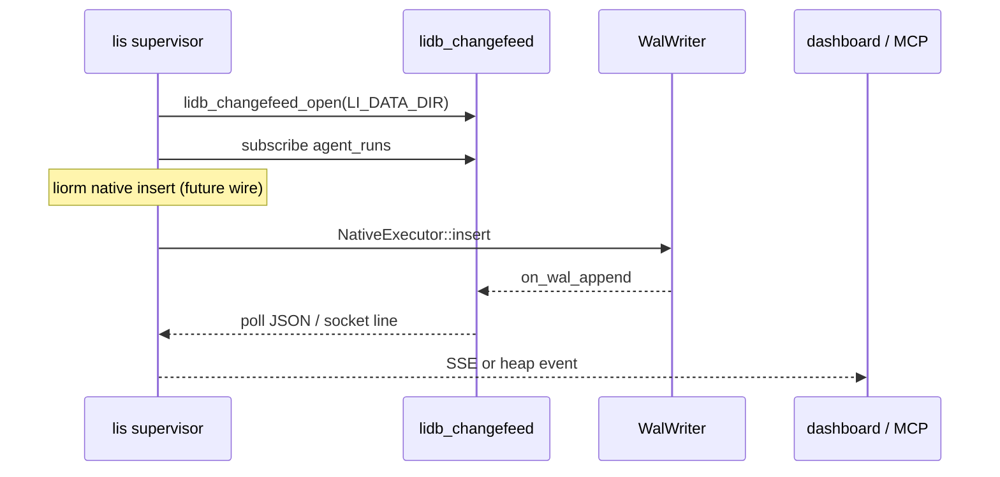

# Changefeed (native WAL)

**PH-DB:** realtime row notifications for **lis** without sqlite triggers or logical replication plugins.

## Model

| Piece | Role |
|-------|------|
| `WalWriter` | Append-only segment (`LIDW` records); `kHeapInsert` / `kHeapUpdate` |
| `NativeExecutor` | Stub executor: `insert(table)` → WAL append → `Changefeed::on_wal_append` |
| `Changefeed` | `subscribe(table, callback)` + poll queue + Unix socket fan-out |
| `lidb_changefeed` (C) | **lis** FFI: poll buffer or `lidb_changefeed_serve_unix` |

**Not in scope:** sqlite `catalog.db` triggers, Postgres `LISTEN/NOTIFY`, or external CDC.

## C++ API

```cpp
#include "lidb/changefeed.hpp"
#include "lidb/native_exec.hpp"

lidb::EmbeddedDatabase db({.data_dir = path});
db.open();
auto* hub = db.changefeed_hub();
auto sub = hub->subscribe("packages", [](const lidb::ChangefeedEvent& ev) {
  // ev.lsn, ev.table, ev.op, ev.payload
});
db.native_executor()->insert("packages");
hub->poll_json_line(line);
```

- Table filter: exact name or `"*"` for all tables.
- Events come only from **native** WAL appends (`NativeExecutor::insert` today).

## C API (lis)

Header: `engine/include/lidb/changefeed_c.h`  
Library: `liblidb_changefeed` (`lidb_changefeed_c` CMake target).

```c
lidb_changefeed* cf = lidb_changefeed_open(data_dir);
lidb_changefeed_subscribe(cf, "agent_runs");
lidb_changefeed_native_insert(cf, "agent_runs");

char buf[4096];
size_t n = 0;
while (lidb_changefeed_poll(cf, buf, sizeof(buf), &n) == 1) {
  /* {"lsn":2,"table":"agent_runs","op":"insert","payload_bytes":0} */
}

lidb_changefeed_serve_unix(cf, "/tmp/lidb-changefeed.sock");
lidb_changefeed_close(cf);
```

### lis realtime integration



**Recommended wiring (registry-min):**

1. **Poll** — background thread calls `lidb_changefeed_poll` every 50–200 ms.
2. **Unix socket** — `lis db start` listens on `$LI_DATA_DIR/.lidb/changefeed.sock`.
3. One `lidb_changefeed_open` per data directory (same process as embedded engine).
4. Do not expect events from sqlite `exec_sql`; only `NativeExecutor` emits today.

| Variable | Default | Purpose |
|----------|---------|---------|
| `LI_DATA_DIR` | `./.li-data` | `lidb_changefeed_open` argument |
| `LIDB_CHANGEFEED_SOCK` | `$LI_DATA_DIR/.lidb/changefeed.sock` | Unix listen path |

## WAL payload (kHeapInsert stub)

```
u32 table_len | table_utf8 | u32 row_len | row_bytes
```

Replay and heap materialization are PH-DB-2+.

## Tests

```bash
scripts/changefeed_smoke.sh
```

## Related

- `docs/handoff-wp5-lis.md`
- `engine/include/lidb/wal.hpp`
