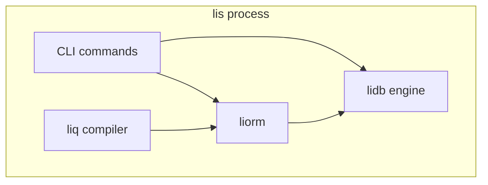

# Handoff: WP5 lis supervisor bundle

**From:** PH-DB-2 (liorm + liq skeleton)  
**To:** PH-DB-3 (lis bundle stub)

## What WP5 should implement

**lis** is the single-binary supervisor: `lis db start|status|migrate|stop`, default ports `54321`/`54322`, env `LI_DATA_DIR`, `LI_PROFILE=registry-min`.

### In-process embedding



- Do **not** open a TCP loopback for registry-min unless profile requests it.
- Pass `&mut Engine` (name TBD from WP1) into `liorm::execute` — no second connection pool.

### Interface contracts (stable after PH-DB-2)

| Component | Contract |
|-----------|----------|
| **liq** | `compile(source) -> { ir, sql, param_schema }`; agents/MCP use liq strings, not raw SQL |
| **liorm** | `execute(plan_id, params)`; `Ident::from_catalog(...)`; plans registered at startup from profile |
| **Profiles** | `profiles/registry-min.toml` lists verticals; pre-register plans: `agent_runs.recent`, etc. |
| **Security** | Agent profile denies `RawSqlCapability`; run `tests/security/run_all.sh` in CI when engine exists |

### Sequencing

1. **WP1** — lidb engine + `migrations/001_registry.sql` (blocking for real `execute`)
2. **WP2** (this PR) — liorm/liq API + security stubs + liq-spec
3. **WP5** — lis CLI + profile TOML + architecture doc; stub engine calls until WP1 merges

### Files WP5 should read

- `liorm/README.md` — execute / Ident API
- `liq/README.md` — example queries for registry-min
- `docs/liq-spec.md` — compilation pipeline
- `tests/security/README.md` — CI gate expectations

### Suggested lis startup (pseudo)

```bash
export LI_DATA_DIR="${LI_DATA_DIR:-./.li-data}"
export LI_PROFILE="${LI_PROFILE:-registry-min}"
lis db start   # loads profile, runs migrations, registers liq plans, listens 54321 if needed
```

WP5 PR branch: `feat/ph-db-3-lis-bundle-stub` (per master plan).
