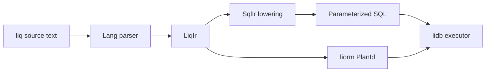

# liq specification (draft)

**Status:** PH-DB-2 skeleton — grammar and IR names are stable for tooling; execution engine TBD.  
**Version:** 0.1.0-draft

## 1. Purpose

**liq** (Li query language) is the agent-first query surface for **lidb**. It trades SQL generality for:

- **Token efficiency** — fewer keywords and punctuation for common registry/control-plane shapes.
- **Safety by construction** — parameters and catalog-bound identifiers; no implicit string building.
- **Dual compilation** — same IR feeds **liorm** prepared plans and native SQL for EXPLAIN/benchmark parity.

SQL remains first-class for migrations, ad-hoc DBA, and Postgres compatibility tests.

## 2. Design goals

| Goal | Mechanism |
|------|-----------|
| Smaller LLM context | `read` / `insert` / `update` / `delete` verbs; optional schema; inferred `public` under `registry-min` |
| Injection resistance | `$param` value slots; `Ident` from catalog only |
| Identifier injection resistance | No quoted user strings as table/column names |
| Second-order safety | Stored values bound as parameters on re-execution |
| Auditability | `LiqIr` serialized in plan registry; `RawSqlCapability` separate path |

## 3. Token efficiency vs SQL

Rough comparative token counts (GPT-style tokenizer, illustrative):

| Query | SQL tokens (~) | liq tokens (~) | Δ |
|-------|----------------|----------------|---|
| Top-N list | 28 | 12 | −57% |
| Filtered list | 35 | 16 | −54% |
| Single-row insert | 32 | 14 | −56% |

liq omits `SELECT`, `FROM`, `AS`, redundant aliases, and explicit `public.` when profile sets `search_path`. Punctuation is whitespace-separated words (no trailing semicolons required in embedded mode).

**Non-goals for v0:** arbitrary subqueries, `WITH RECURSIVE`, dialect-specific hints, COPY protocol strings.

## 4. Surface grammar (EBNF sketch)

```ebnf
program     ::= statement
statement   ::= read_stmt | insert_stmt | update_stmt | delete_stmt
read_stmt   ::= "read" ident projection? filter? order? limit?
projection  ::= "{" ident_list "}"
filter      ::= "where" predicate
order       ::= "order" ident ("asc" | "desc")?
limit       ::= "limit" integer
insert_stmt ::= "insert" ident "{" field_bindings "}"
update_stmt ::= "update" ident "set" field_bindings filter? "returning" ident_list?
delete_stmt ::= "delete" "from"? ident filter?
ident       ::= NAME ("." NAME)*
param       ::= "$" NAME
```

`NAME` must resolve via catalog at compile time (or fail).

## 5. Compilation pipeline



### 5.1 Lang

- Lexical: words, `$params`, integers, string literals (values only).
- Parse errors are localized; no partial SQL emission on failure.

### 5.2 LiqIr

Typed AST nodes: `Read`, `Insert`, `Update`, `Delete`, `IdentRef`, `ParamRef`, `Const`, `Order`, `Limit`.  
Each `IdentRef` carries `catalog_id` after resolution, not raw strings.

### 5.3 SqlIr

Postgres-shaped relational algebra subset: `Scan`, `Filter`, `Project`, `Sort`, `Limit`, `InsertValues`, `UpdateSet`.  
Lowering applies quoting rules from validated `Ident`s only.

### 5.4 SQL emission

- Always **positional or named** prepared parameters for values.
- Identifier slots filled from catalog at compile time (constants in plan blob).
- Plan fingerprint stored for cache and audit logs.

## 6. liorm integration

1. `liq::compile(source) -> CompileResult { ir, sql, param_schema }`
2. `liorm::register_plan(name, ir) -> PlanId`
3. `liorm::execute(plan_id, params) -> Rows`

Agents should prefer `liq` → compile once → `execute` on hot paths.

## 7. Raw SQL and capabilities

Operations outside the liq subset require an explicit capability token (see security tests):

- `RawSqlCapability::Session` — one-shot session SQL (CLI admin)
- `RawSqlCapability::Migration` — migration runner only

Capabilities are not granted to MCP/agent profiles by default.

## 8. Compatibility and benchmarking

- **Subset:** liq v0 targets registry schema in `migrations/001_registry.sql` (WP1).
- **Parity:** compiled SQL must be byte-comparable to hand-written SQL for the same intent (modulo whitespace).
- **Bench:** compare liq→SQL→lidb vs raw SQL→Postgres on identical plans (PH-DB-4+).

## 9. Open questions

- `read` vs `select` keyword — `read` chosen for token count; alias `select` optional in 0.2?
- Vector / embedding operators — extension ops under `read ... similar $vec` (PH-DB-7).
- RLS: predicates injected at SqlIr from session context (PH-DB-5).

## 10. References

- [liq README](../liq/README.md) — examples
- [liorm README](../liorm/README.md) — `execute`, `Ident::from_catalog`
- [tests/security/README](../tests/security/README.md) — CVE-oriented harness
